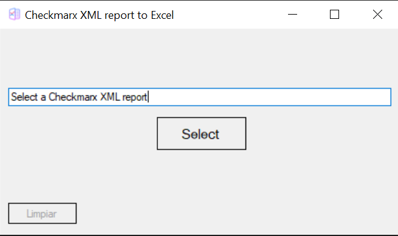
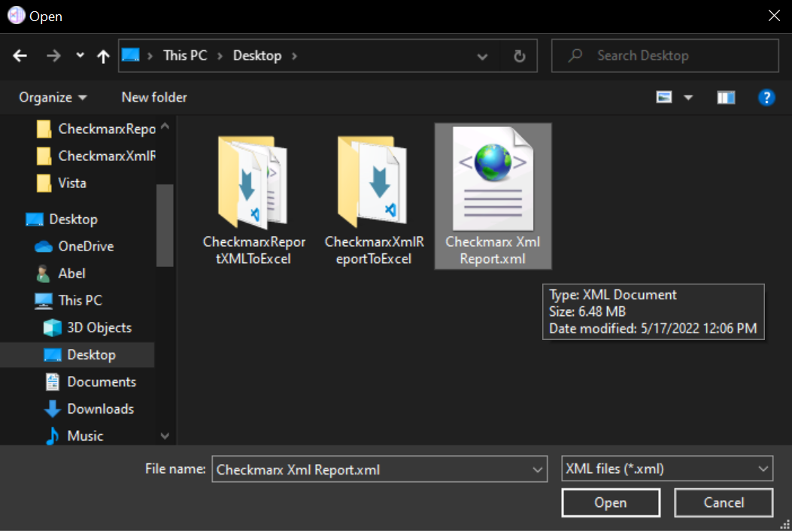
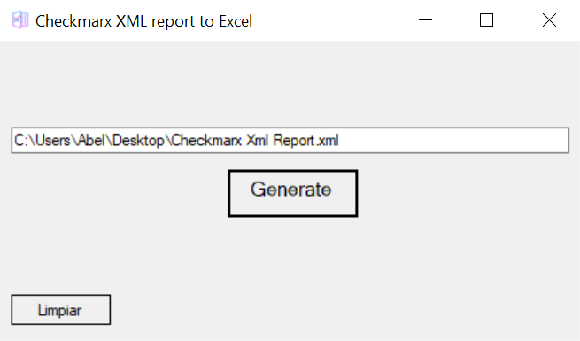
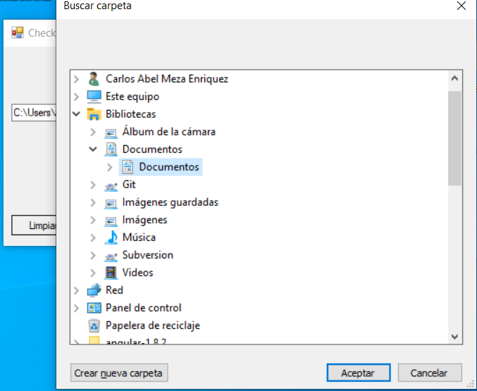
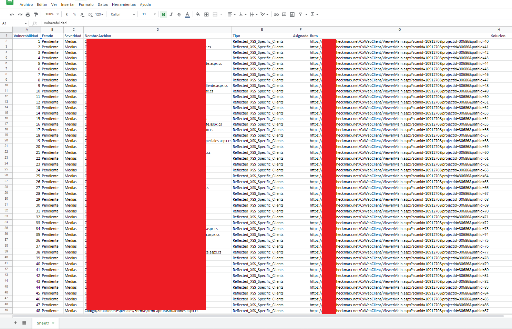

# CheckmarxReportXMLToExcel

Convert a Checkmarx report in XML format to Excel

### The main screen opens

### Select the Checkmarx report in XML format

### Once the file is selected, press Generate

### Select the directory where you want the Excel report to be saved

### All done!, just adjust the columns width

